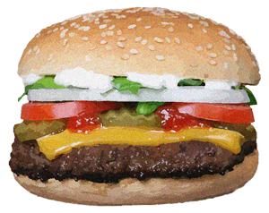

# Eat da Burger

## Overview

Burger logger app using MySQL, Node, Express, Handlebars and ORM. The application follows the MVC design pattern: using Node and MySQL to query and route data and Handlebars to generate HTML.

[See it in action!](https://burger-burger.herokuapp.com/)

## How it Works

* Whenever a user submits a burger's name, your app will display the burger on the left side of the page -- waiting to be devoured.
* Each burger in the waiting area is a button. When the user clicks it, the burger will move to the right side of the page.
* Every burger is stored in a database, whether devoured or not.

## Technologies Used:

* Node.js
* mySQL
* npm Packages
	* [Express](https://www.npmjs.com/package/express)
	* [body-parser](https://www.npmjs.com/package/body-parser)
	* [express-handlebars](https://www.npmjs.com/package/express-handlebars)
    * [method-override](https://www.npmjs.com/package/method-override)
    * [mySQL](https://www.npmjs.com/package/mysql)
* [Materialize](http://materializecss.com/)
* [Google Fonts API](https://fonts.google.com)